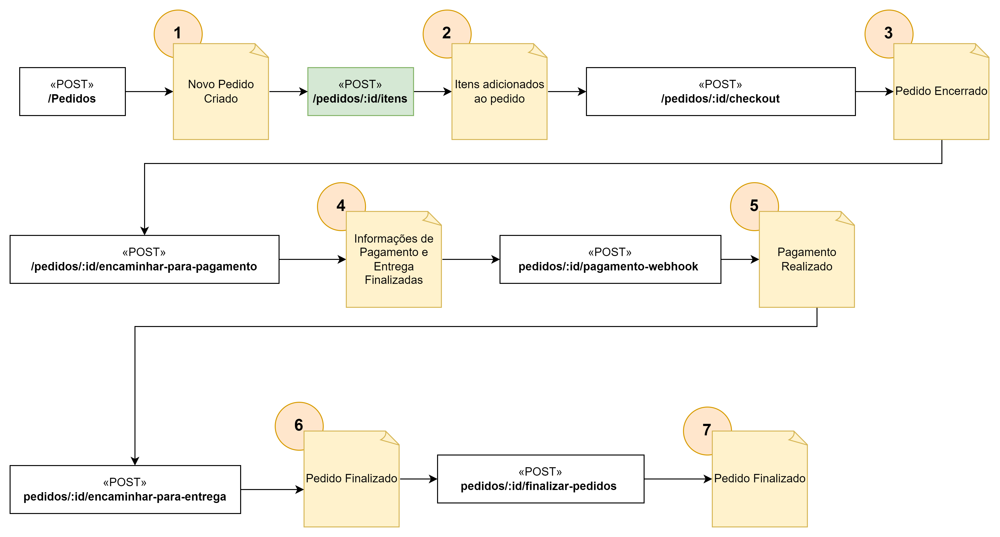

# Inicie um pedido

Com a API Lanchonete da Rua Instalada, algumas tabelas são preenchidas com [valores de demonstração](valores-demonstracao.md):



### 1) Inicie um novo pedido com o identificador do cliente, a sessão de navegação alguma outra informação como se segue no exemplo:

```bash
curl -X 'POST' \
  'http://127.0.0.1:5000/pedidos/' \
  -H 'accept: application/json' \
  -H 'Content-Type: application/json' \
  -d '{
        "cliente_id": 1,
        "session_id": "cliente_navegador_1",
        "observacoes": "sem cebola",
        "status": "EM_ATENDIMENTO"
      }'

```

### 2) Adicione, na ordem que quiser, os produtos no pedido criado, informando o produto e o valor.


```bash
curl -X 'POST' \
  'http://127.0.0.1:5000/pedidos/1/itens' \
  -H 'accept: application/json' \
  -H 'Content-Type: application/json' \
  -d '{
  "pedido_id": 1,
  "produto_id": 1,
  "quantidade": 2,
  "valor": 40.8
     }'

```

### 3) Encerre o pedido

```bash
curl -X 'PATCH' \
  'http://localhost:5000/pedidos/1/encaminhar-para-pagamento' \
  -H 'accept: application/json'
```

### 4) Prepare o pedido para pagamento e entrega (checkout)
```bash
curl -X 'POST' \
  'http://localhost:5000/pedidos/1/checkout' \
  -H 'accept: application/json' \
  -d ''
```

### 5) Aguarde o pagamento do pagseguro

Esse endpoint será acionado pelo gateway de pagamento. Quando a PagSeguro obtiver o status de pagamento ok, enviar esses dados para atualizarmos nossas bases de dados.

```bash
curl -X 'POST' \
  'http://localhost:5000/pedidos/pagamento-webhook' \
  -H 'accept: application/json' \
  -H 'Content-Type: application/json' \
  -d '{
  "id": 1,
  "status": "approved",
  "external_reference": 12255
}'
```

### 6) Verifique a fila da cozinha

Esse endpoint seria apenas para verificar a fila de atendimento da cozinha

curl -X 'GET' \
  'http://localhost:5000/pedidos/na-fila' \
  -H 'accept: application/json'

### 7) Finaliza pedido

Esse endpoint encerra o pedido pela cozinha e o disponibiliza para entrega

```bash
curl -X 'PATCH' \
  'http://localhost:5000/pedidos/1/finalizar-pedido' \
  -H 'accept: application/json'
```

### 7) Encaminhado para entrega
Esse endpoint encerra o pedido. 

```bash
curl -X 'PATCH' \
  'http://localhost:5000/pedidos/1/encaminhar-para-entrega' \
  -H 'accept: application/json'
```

## Veja também:

[Overview da API](./overview.md)

